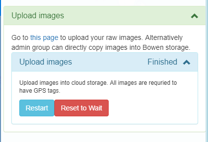
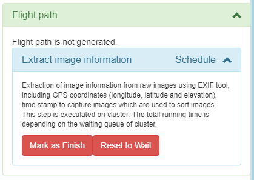
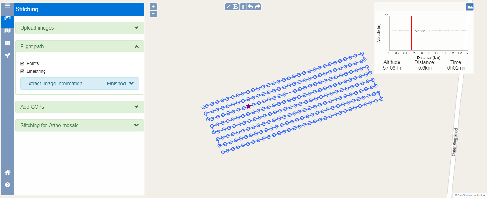
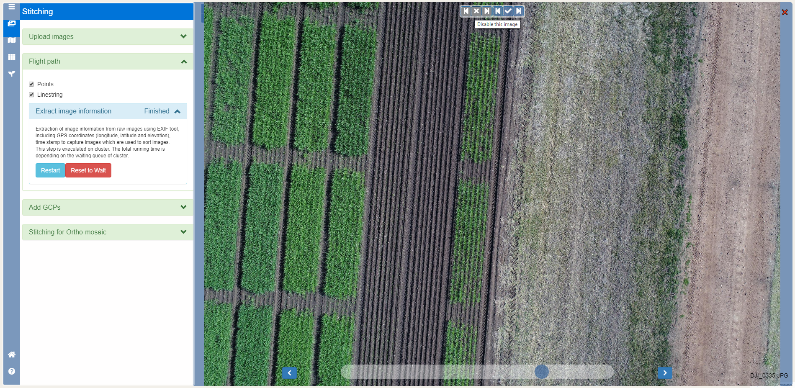

The final object is to creat an *ortho-mosaic* for **RGB images** by taking the following procedures.

Click the second tag on the left panel to open the **stitching** interface, showing **Upload images**, **Flight path**, **Add GCPs**, **Stitching for Ortho-mosaic**.

The ortho-mosaic for RGB images is generated by performing the following steps: [**Upload images**](stitching.html#upload-images), [**Creat flight path**](stitching.html#creat-flight-path), [**Add GCPs**](stitching.html#add-gcps), [**Stitch images**](stitching.html#stitch-images). 

## Upload images

Click **Upload images** to show the drop-down menu.

Click **this page** colored in blue to open the new page for data uploading. Upload raw images according to instructions on the page. Once uploading is finished, return to the **Upload images** interface.

Click **Start** and **Mark as Finished** in sequence. The status of **Upload images** changes from **Ready** to **Scheduled** and finally **Finished**. Now it is time to do the next step.

## Creat flight path

Click **Flight path** to show the drop-down menu.

Click **Start** button, the status changes from **Ready** to **Scheduled** and then **Processing**.

Once flight path is created, the status will change to **Finished**. The flight path can be shown in both types of **Points** and **Linestring**.

Click the tag circled in red on the top-right conner to open a pop-up window showing images information in time squence. Moving the red line on the diagram locates to a specific image that is highlighted in a red star differential to other blue circles on the map.

Click any point on the map to open a pop-up panel where you can **enable/disable** *all images before*, *this image*, or *all images after*.

## Add GCPs

Click **Add GCPs** to show the drop-down menu.

Select the appropriate EPGS on the drop-down list and upload GCPs by clicking the **Choose file** button.Now all the GCPs are shown on both the list and the map.

Select 3-5 images in the surrounding of each GCP. Associate these iamges to the selected GCP one by one. Modify or delete a GCP on a image using the button just in front of the button **Add a new point as GCP**.

Click **Start** and **Mark as Finished** in sequence. The status of **Upload images** changes from **Ready** to **Scheduled** and finally **Finished**. Now it is time to do the next step.

<video autosize:TRUE controls>
  <source src="stitching/add_GCP.mp4" type="video/mp4">
</video>
  

## Stitch images

Click **Stitching Mosaic** to show the drop-down menu.

Click **Start** button, the status changes from **Ready** to **Scheduled**. The sitching process will be automatically performed in the background. 

Once the *ortho-mosaic* is created, the status will change to **Finished** and the **ortho-mosaic** image will be shown on the screen.

