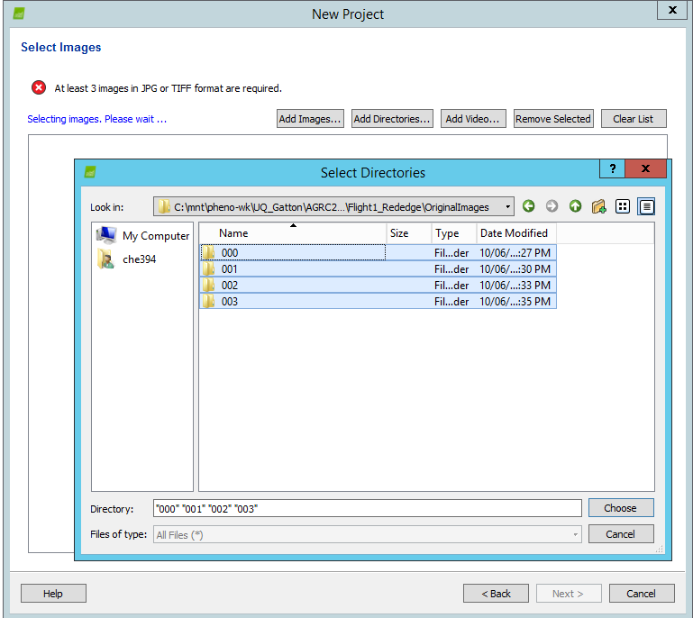
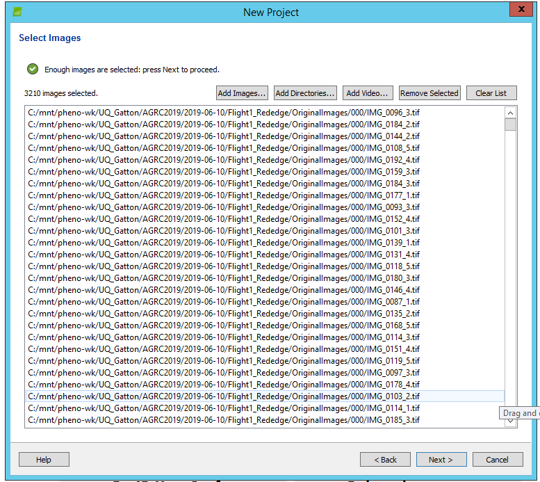
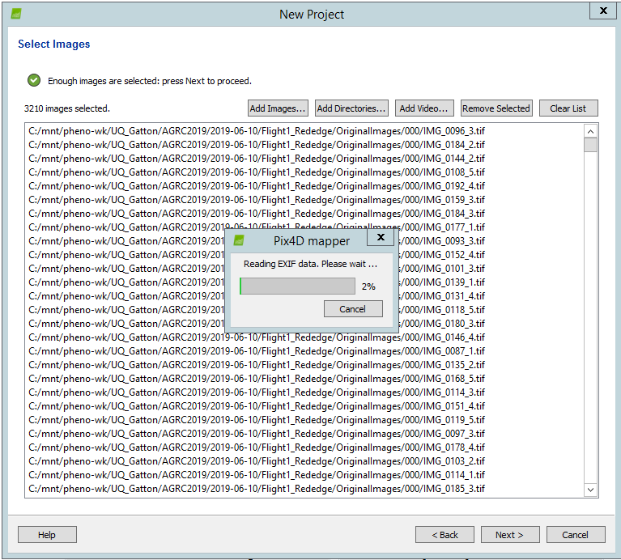
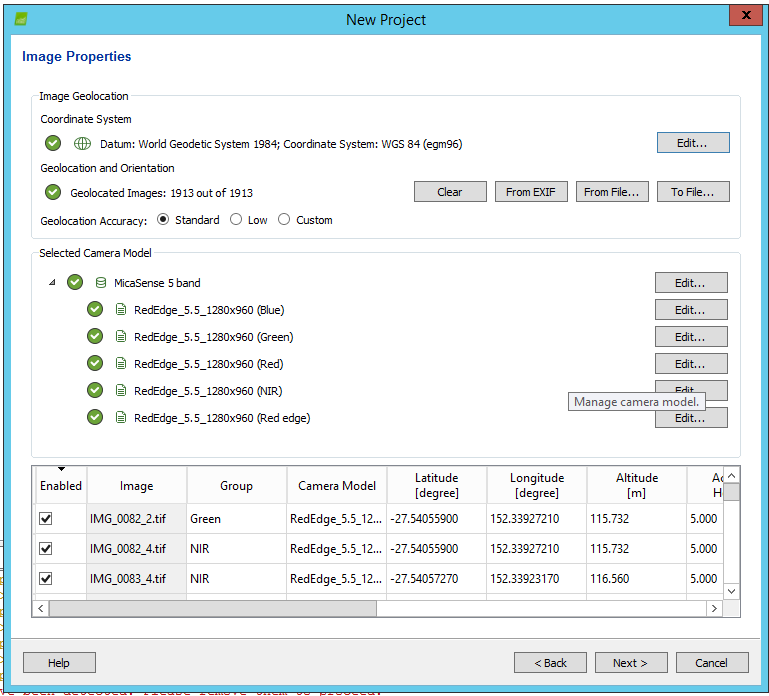
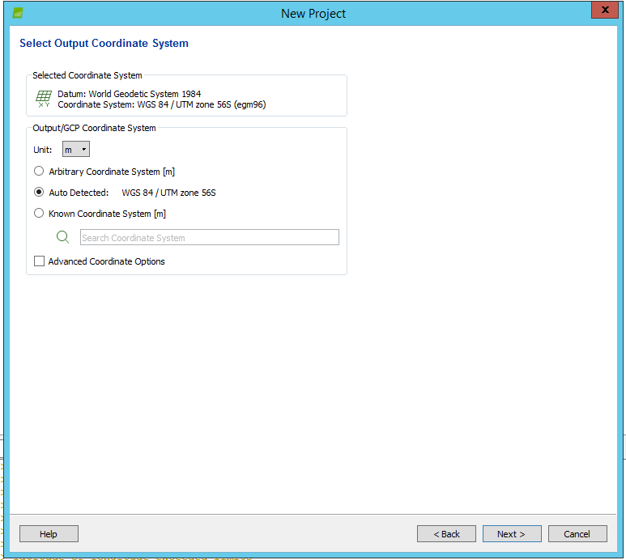
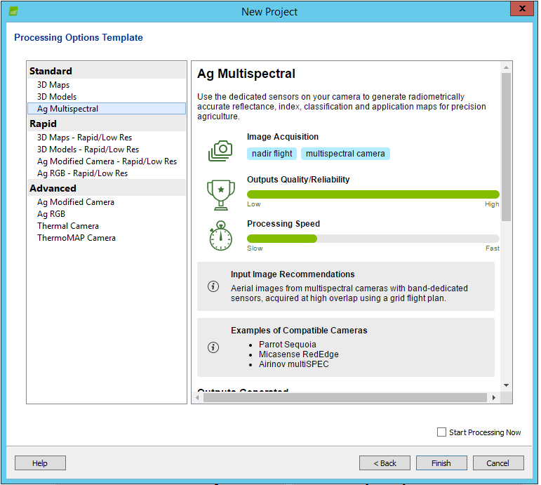

The final object is to creat an *ortho-mosaic* for **RedEdge images** by taking the following procedures.

This process consists of uploading images through this website and manually running Pix4D software.

## Upload images

This step is the same to [uploading RGB images](stitching.html#upload-images).

## Run Pix4D for performing other steps

A useful tutorial video: [How to Process MicaSense Sensor Data in Pix4D] (https://support.micasense.com/hc/en-us/articles/115000831714-How-to-Process-MicaSense-Sensor-Data-in-Pix4D)

### Create a new project

Open Pix4D sofeware, and click **New Project ...** to open the interface for creating a new project. To complete the creation of a new project, several steps need to be finished one by one:

- set path and name of the project

- select images for processing

Add directories              |  Import images            |  Read images
:-------------------------:|:-------------------------:|:-------------------------:
   |   | 

- set image properties, output coordinate system, process template

Image properties           | Output coordinate system  | Process option template
:-------------------------:|:-------------------------:|:-------------------------:
   |   | 

### Adjust processing options

- Select *Processing optioms* -> *1.Initial Processing* -> *Calibration*, choose **All Prior** on the drop-down list of *Internal Parameters Optimization*.

- Calibrate reflectance: Select *Processing optioms* -> *3.DSM,Orthomosaic and Index* -> **Index Calculation**, choose **Camera Only** as *Correction Type*, Click *Calibrate...* to open the pop-up window, then import the corresponding band image using the *Brown* button, complete the reflectance calibration by drawing a rectangle on the calibration panel and inputting the reflectance factor of this band.

- Set raster output option

### Add GCPs

