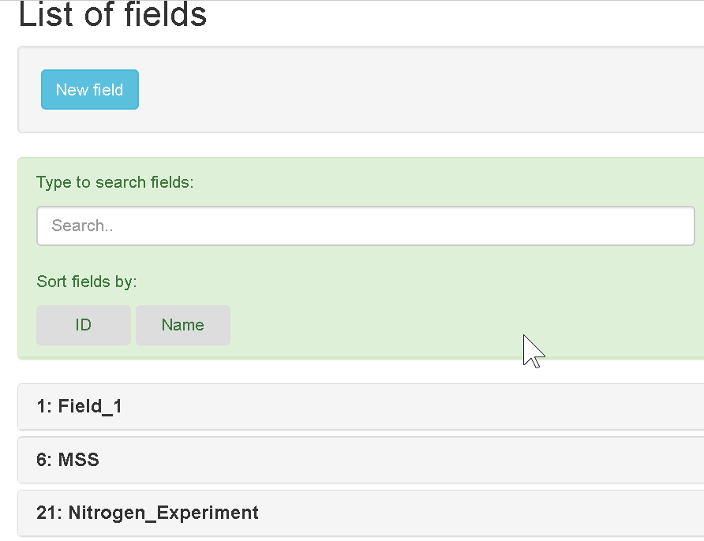

---
title: "Field"
author: Bangyou Zheng
date: '2019-06-10'
slug: field
tags:
  - field
output:
  blogdown::html_page:
    toc: false
---

### Create a new field
A new field can be created in the page of *Field* list. Just click the button `New Field`, then select a `farm` from list, 
type a `field name` and  `note`, finally click the `Submit` button. 

You can type to search the farm name in the list.

